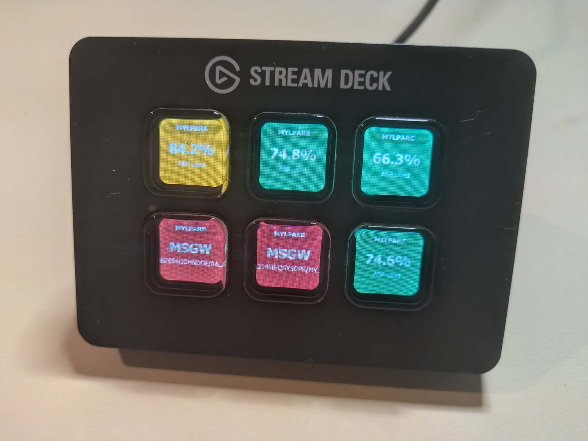
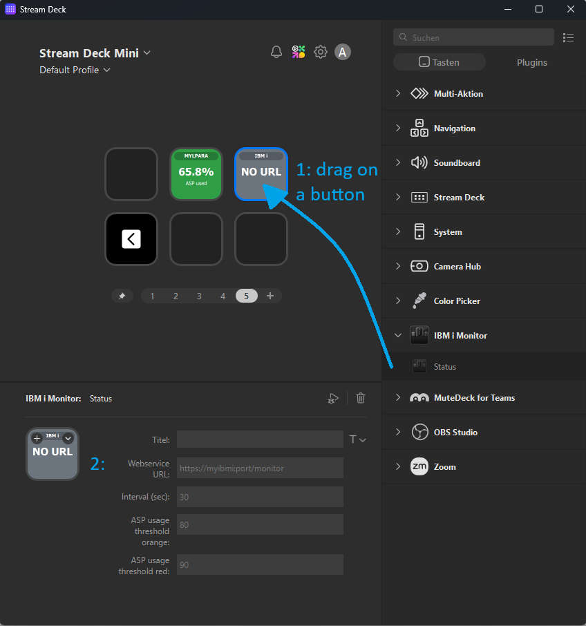
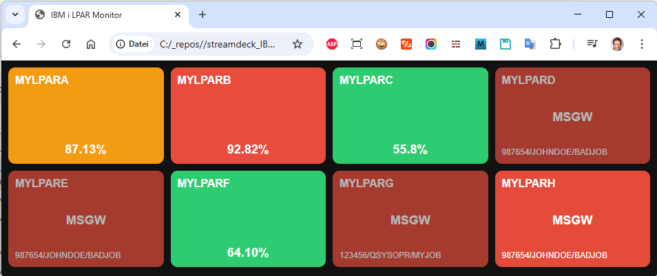

# IBM i Monitor for Stream Deck / html page



## Installation of the web service on the IBM i

Whether you use a streamdeck or just the html page, you have to somehow provide the data from the IBM i partitions.

You can use whatever you want to create the JSON data on the IBM i.

I chose to do it with php (Alan Seiden's Community Edition) and Apache.

Just copy the php/ibmimontor.php to a directory in your document root of your web server (i chose "apis") and make sure it is accessible via http(s).

Example: `https://myibmi/apis/ibmimontor.php`

In my case, no user authentication is required.

If you want to test it with e.g. a Raspberry Pi, use the ibmimonitor_mockup.php file. It is generating random data for fake LPARs and accepts a system parameter for distinctive LPAR names.

The JSON data provided by the web service should look like this (formatted for better readability, the actual output is minified):

```json
{
    "LPAR": "IDEFIX",
    "ASP_USED": "84.01",
    "JOBS_IN_MSGW": [
        {
            "JOB": "654321/ROMAN/CLAP01"
        },
        {
            "JOB": "654322/ROMAN/CLAP02"
        },
        {
            "JOB": "654323/ROMAN/CLAP03"
        }
    ]
}
```

## Plugin for Elagato's Stream Deck

This plugin is retrieving JSON data from a web service running on an IBM i providing information about the system asp usage and jobs in message-wait status.

## Installation of the plugin (Windows)

Clone the repo to your PC.

Create a link to `path_of_the_cloned_repository/dev.agomb.ibmimontor.sdPlugin` in the Stream Deck plugins folder. The location of the plugins folder is usually:

`%USERPROFILE%\AppData\Roaming\Elgato\StreamDeck\Plugins`

You can also copy or move the directory `path_of_the_cloned_repository/dev.agomb.ibmimontor.sdPlugin` and everything below to the plugin directory and delete the rest of the cloned repo afterwards. This might be more practical if you do not plan to change or extend the plugin.

## Installation of the plugin (all other platforms)

I guess it's similar, i have no other platform to test on. See Elgato's website for infos about that.

## Configuration of the plugin

In the Stream Deck software, you can add the "IBM i Monitor" action to a button. Then you can configure the URL of the web service and the refresh interval.

Example URL: `https://myibmi/apis/ibmimontor.php`
The plugin will then retrieve the data from the web service at the specified interval and display the information on the button.

## Streamdeck using ibmimonitor_mockup



1. Drag the "Status" action to a button on the Stream Deck.
2. Click on the button to open the configuration and fill in the URL of the webservice providing the JSON with the LPAR info.

Repeat the steps for as many buttons as you want to monitor different LPARs. You can use the ibmimonitor_mockup.php file to test it with fake data.

## Web page using ibmimonitor_mockup

(file html/ibmimonitor.html is 100% ChatGPT generated and just a demo what you can easily achieve.)

You just have to open html/ibmimonitor.html and insert the URLs of the web service for the different LPARs in the array "endpoints".


Open the page in your browser and you should see the status of the different LPARs.

